```markdown
# Jenkins Job Enhancement and Ansible Code Refactoring

This guide covers two main objectives:
1. Enhancing a Jenkins job for efficient artifact storage.
2. Refactoring Ansible playbooks for better code management.

## Step 1: Jenkins Job Enhancement

### Goal
Modify the Jenkins job to store build artifacts in a single, consistent directory, which prevents clutter and conserves space on the Jenkins server.

### Instructions

#### 1. Create Artifact Directory on Jenkins Server
On your Jenkins-Ansible server, create a directory for storing build artifacts.

```bash
sudo mkdir /home/ubuntu/ansible-config-artifact
sudo chmod -R 0777 /home/ubuntu/ansible-config-artifact
```

#### 2. Install the Copy Artifact Plugin
- Go to **Jenkins Web Console** → **Manage Jenkins** → **Manage Plugins**.
- In the **Available** tab, search for `Copy Artifact` and install it.

#### 3. Create a New Jenkins Job for Saving Artifacts
- In Jenkins, create a new **Freestyle project** named `save_artifacts`.
- Set this job to be triggered after the completion of your existing `ansible` project.
- Under the **Build** step:
  - Choose **Copy artifacts from other project**.
  - Specify `ansible` as the source project.

  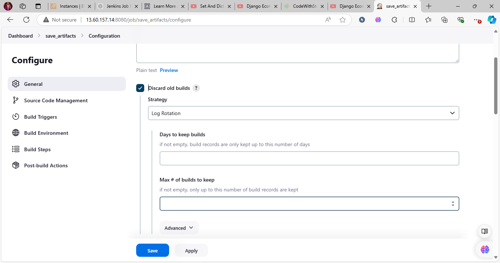
  - Set `/home/ubuntu/ansible-config-artifact` as the target directory.
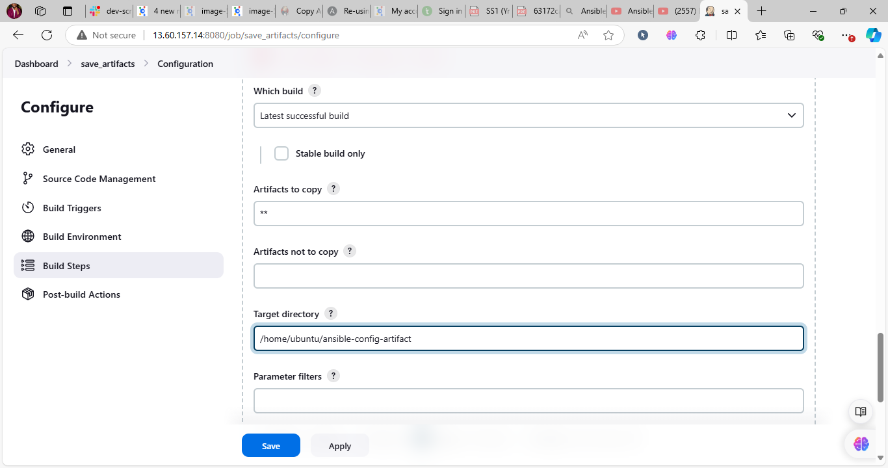
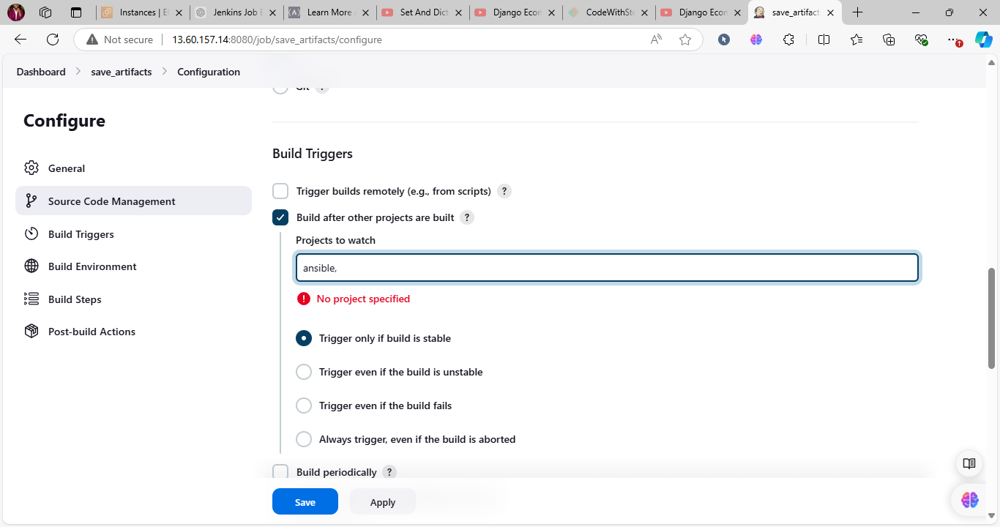
#### 4. Configure Build Retention Policy
(Optional) Configure the **Number of builds to keep** in both the `ansible` and `save_artifacts` jobs to manage disk space. Keeping the last 2-5 builds is recommended.

#### 5. Test the Setup
Make a minor change in the `README.md` file in your `ansible-config-mgt` repository (on the `master` branch). Commit and push the changes. If configured correctly:
- Both Jenkins jobs should run sequentially.
- The `ansible-config-artifact` directory should update with the latest build artifacts.
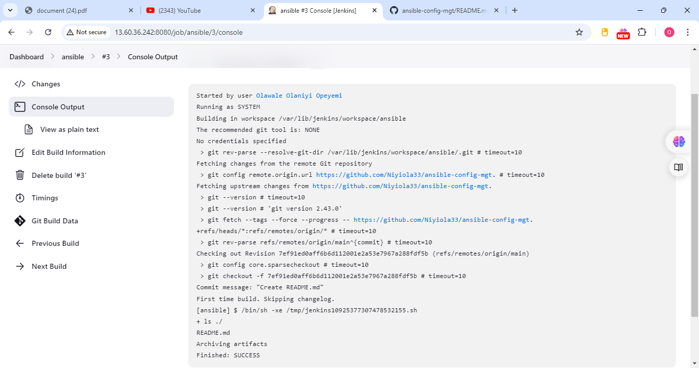
### Expected Outcome
Your Jenkins pipeline should now store artifacts in a central directory, ensuring a more organized and space-efficient setup.

## Step 2: Refactor Ansible Code by Importing Playbooks

### Goal
Refactor the Ansible playbooks for better organization and maintainability, using a `site.yml` entry point and modular playbooks.

### Instructions

#### 1. Pull Latest Code and Create a New Branch
```bash
git pull origin main
git checkout -b refactor
```

#### 2. Set Up Site Playbook Structure
- Create a new file in the `playbooks` folder named `site.yml`. This will serve as the main entry point for your infrastructure configuration.

#### 3. Organize Playbooks into `static-assignments` Folder
- In the root of your repository, create a folder named `static-assignments`.
- Move your existing `common.yml` playbook to the `static-assignments` folder.

#### 4. Configure `site.yml` to Import Playbooks
In `site.yml`, import the `common.yml` playbook:

```yaml
---
- hosts: all
- import_playbook: ../static-assignments/common.yml
```

#### 5. Verify Directory Structure
Your repository should now look like this:

```
├── static-assignments
│   └── common.yml
├── inventory
│   ├── dev
│   ├── stage
│   ├── uat
│   └── prod
└── playbooks
    └── site.yml
```
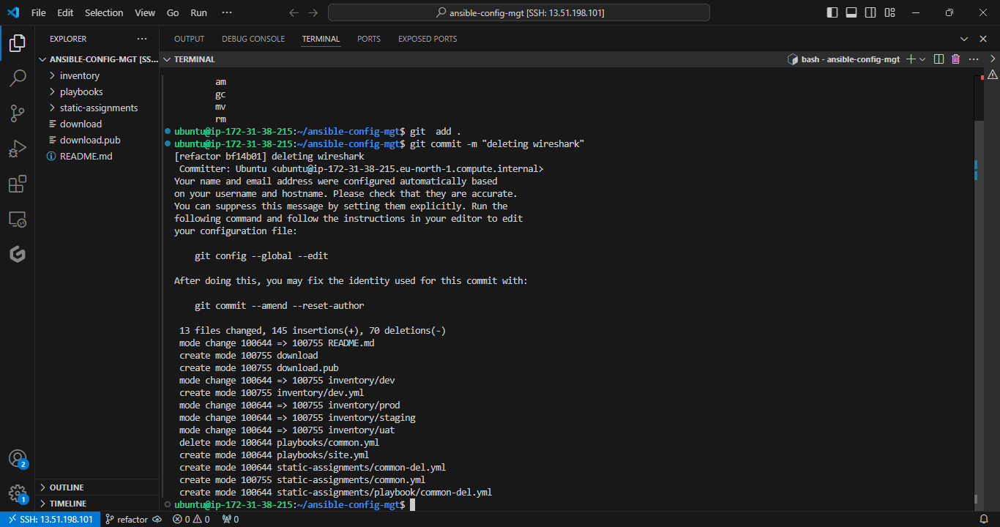
#### 6. Test the Playbook
Run the `site.yml` playbook on the `dev` environment to ensure it's working as expected:

```bash
ansible-playbook -i inventory/dev.yml playbooks/site.yml
```

### Adding a New Playbook for Deleting Wireshark

#### 1. Create `common-del.yml` in `static-assignments`
This playbook will delete the Wireshark utility from specified servers.

```yaml
---
- name: update web, nfs, and db servers
  hosts: webservers, nfs, db
  remote_user: ec2-user
  become: yes
  tasks:
    - name: delete wireshark
      yum:
        name: wireshark
        state: removed

- name: update LB server
  hosts: lb
  remote_user: ubuntu
  become: yes
  tasks:
    - name: delete wireshark
      apt:
        name: wireshark-qt
        state: absent
        autoremove: yes
        purge: yes
        autoclean: yes
```
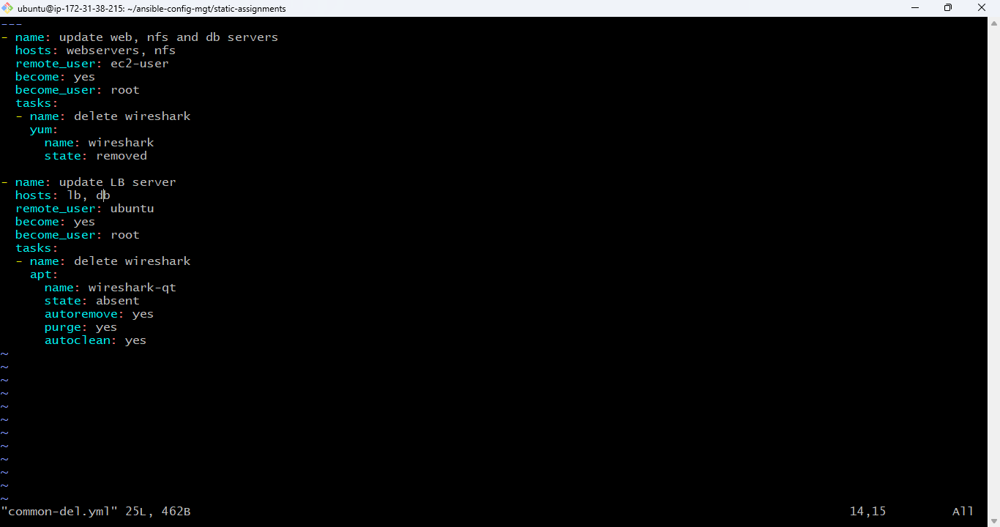
#### 2. Update `site.yml` to Import `common-del.yml`
Replace the import in `site.yml` to include `common-del.yml`:

```yml
---
- hosts: all
- import_playbook: ../static-assignments/common-del.yml
```
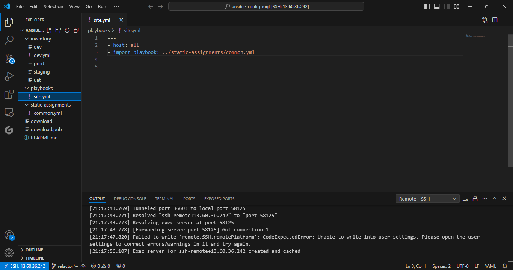
#### 3. Apply and Test
Run the updated `site.yml` against the `dev` environment:

```bash
ansible-playbook -i inventory/dev.yml playbooks/site.yml
```
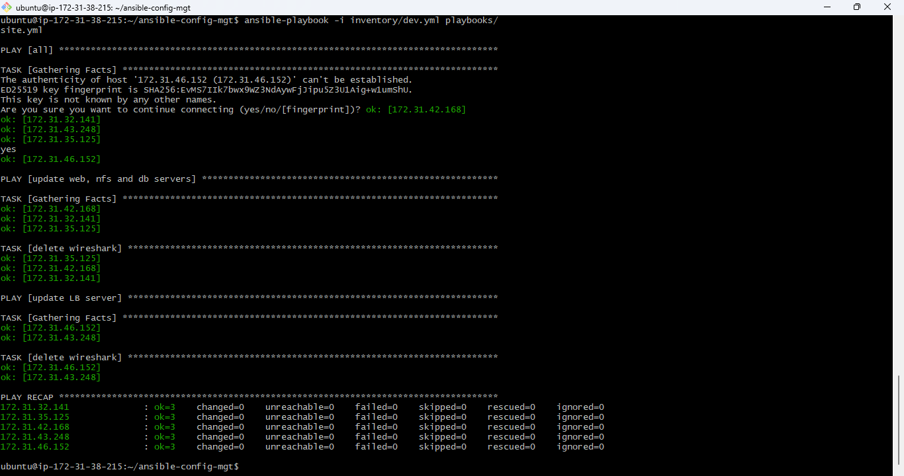
#### 4. Verify Deletion of Wireshark
Check that Wireshark is uninstalled on the servers by running:

```bash
wireshark --version
```
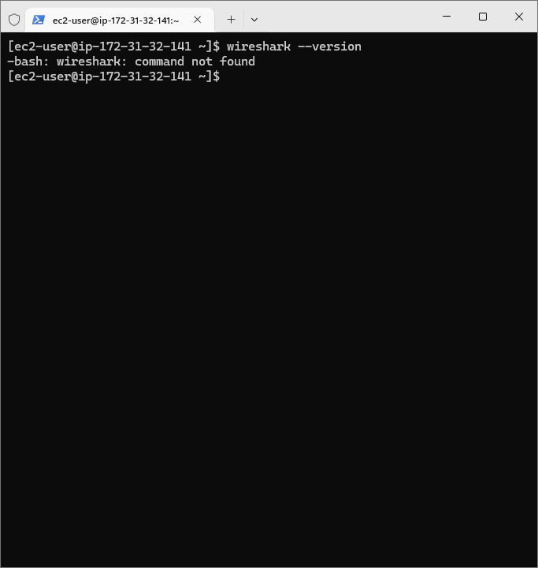
### Outcome

```markdown
# Step 3: Configure UAT Web Servers with a Role `webserver`

This section describes how to set up a dedicated `webserver` role in Ansible to configure two new UAT web servers. By using a role, we maintain a clean, reusable structure for configuring web servers.

## Prerequisites

1. **Launch 2 New EC2 Instances**: Use RHEL 8 as the image and name them `Web1-UAT` and `Web2-UAT`.
   > **Tip**: To save costs, remember to stop any unused EC2 instances.

2. **Ensure Active Instances**:
   - 2 RHEL 8 servers for UAT web servers
   - 1 existing Jenkins-Ansible server

## Role Setup in Ansible

### 1. Create the `roles` Directory

Create a `roles` directory inside your `ansible-config-mgt` repository. Then, create the `webserver` role using either the `ansible-galaxy` command or by manually creating the folder structure.

#### Option 1: Use `ansible-galaxy`

Navigate to the `roles` directory:

```bash
mkdir roles
cd roles
ansible-galaxy init webserver
```

#### Option 2: Create the Structure Manually

Create the `webserver` directory structure as shown below:

```
└── webserver
    ├── README.md
    ├── defaults
    │   └── main.yml
    ├── handlers
    │   └── main.yml
    ├── meta
    │   └── main.yml
    ├── tasks
    │   └── main.yml
    └── templates
```
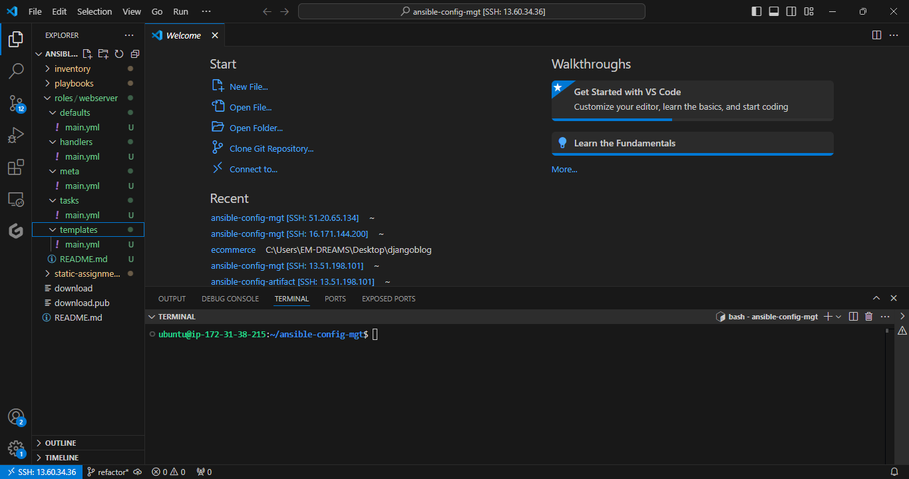
You can remove the `tests`, `files`, and `vars` directories if you created them using `ansible-galaxy`, as they are not needed for this configuration.

### 2. Update the UAT Inventory

Edit the `uat.yml` inventory file (`ansible-config-mgt/inventory/uat.yml`) and add the private IP addresses for your UAT web servers:

```yaml
[uat-webservers]
<Web1-UAT-Server-Private-IP-Address> ansible_ssh_user='ec2-user'
<Web2-UAT-Server-Private-IP-Address> ansible_ssh_user='ec2-user'
```
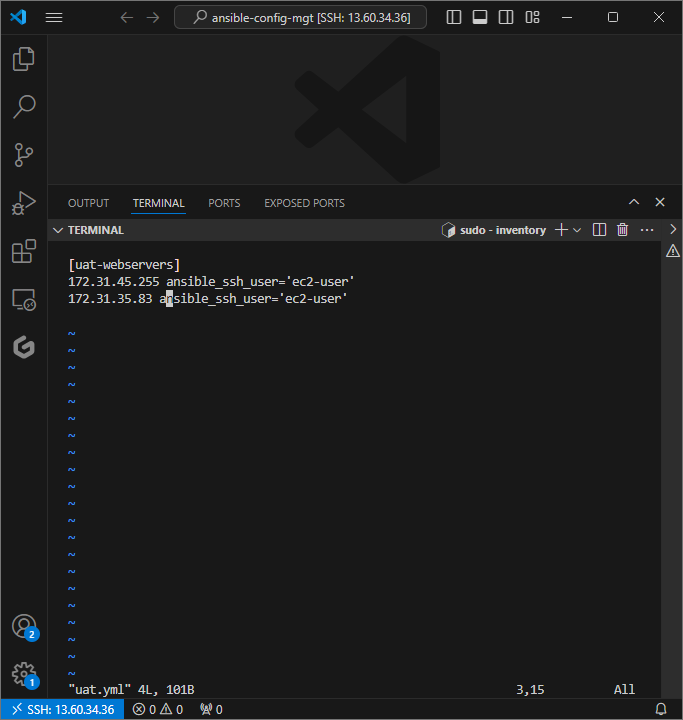
### 3. Update the `ansible.cfg` File

To ensure Ansible knows where to find the `webserver` role, update the `roles_path` in the `/etc/ansible/ansible.cfg` file:

```ini
roles_path = /home/ubuntu/ansible-config-mgt/roles
```

## Configuring the `webserver` Role

In the `tasks` directory of the `webserver` role, edit `main.yml` to include tasks that install Apache, deploy the website code, and start the service.

### Sample `main.yml` File for `webserver` Role

```yaml
---
- name: Install Apache
  become: true
  ansible.builtin.yum:
    name: "httpd"
    state: present

- name: Install Git
  become: true
  ansible.builtin.yum:
    name: "git"
    state: present

- name: Clone the Tooling Website Repository
  become: true
  ansible.builtin.git:
    repo: https://github.com/<your-username>/tooling.git
    dest: /var/www/html
    force: yes

- name: Copy HTML Content to Root Directory
  become: true
  command: cp -r /var/www/html/html/ /var/www/

- name: Start Apache Service
  become: true
  ansible.builtin.service:
    name: httpd
    state: started

- name: Remove Extra HTML Directory
  become: true
  ansible.builtin.file:
    path: /var/www/html/html
    state: absent
```
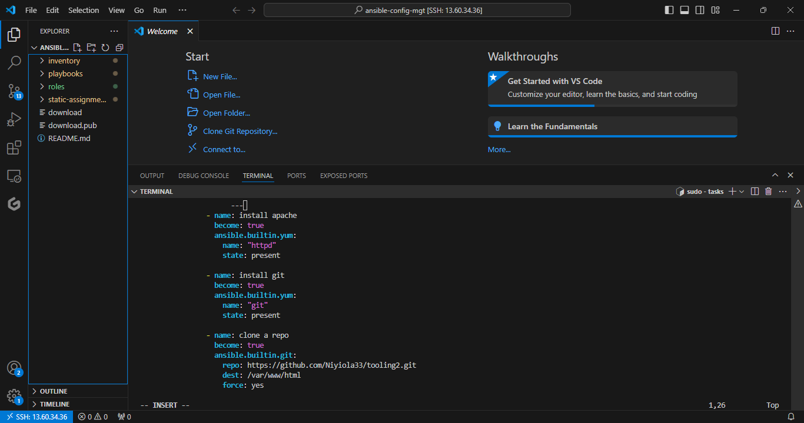
### Explanation of Tasks
1. **Install Apache**: Installs the `httpd` package (Apache web server).
2. **Install Git**: Installs Git to allow repository cloning.
3. **Clone Website Repository**: Clones the tooling repository from GitHub into `/var/www/html`.
4. **Copy HTML Content**: Copies website files up one directory level.
5. **Start Apache**: Ensures the `httpd` service is started.
6. **Clean Up**: Removes the unnecessary `/var/www/html/html` directory.

## Applying the Role

Run the following command to apply the `webserver` role to the UAT web servers:

```bash
ansible-playbook -i inventory/uat.yml playbooks/site.yml
```

Make sure to replace `<your-username>` in the Git repository URL with your actual GitHub username.

### Expected Outcome
The tooling website should be deployed to `/var/www/html` on both UAT servers, and the Apache service should be running. You can test the setup by navigating to the servers' IP addresses in a web browser.

---

This completes the setup of the UAT web servers using a dedicated `webserver` role, improving configuration reusability and manageability.
### Step 4: Reference the `webserver` Role

Now that the `webserver` role has been created, we will set up a new playbook specifically for UAT web servers.

#### 1. Create `uat-webservers.yml` in `static-assignments`

In the `static-assignments` folder, create a new playbook file named `uat-webservers.yml` and reference the `webserver` role:

```yaml
# static-assignments/uat-webservers.yml
---
- hosts: uat-webservers
  roles:
    - webserver
```
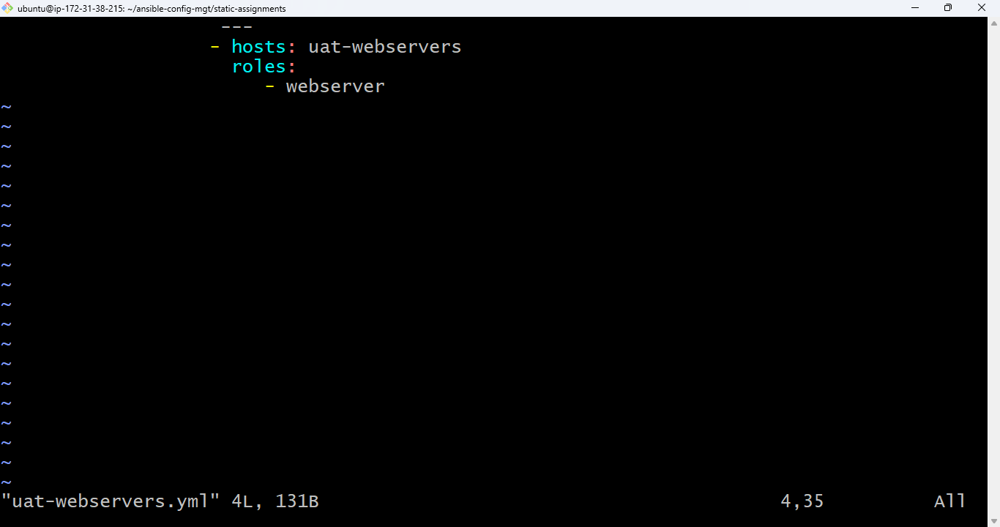
#### 2. Update `site.yml` to Include `uat-webservers.yml`

Since `site.yml` is the entry point for our Ansible configuration, we need to import the `uat-webservers.yml` playbook here. Edit `site.yml` to include the following:

```yaml
# site.yml
---
- hosts: all
  import_playbook: ../static-assignments/common.yml

- hosts: uat-webservers
  import_playbook: ../static-assignments/uat-webservers.yml
```
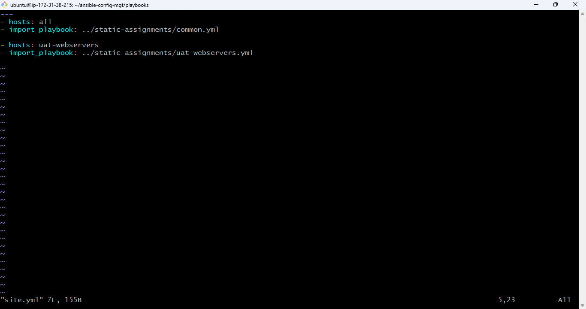
With this setup, `site.yml` will now apply the `uat-webservers.yml` configuration to the UAT web servers when executed.

---

### Step 5: Commit, Test, and Deploy

#### 1. Commit and Push Your Changes

Push the changes to your GitHub repository, create a pull request, and merge it to the `master` branch. This should trigger the webhook and initiate the Jenkins job.

#### 2. Verify Jenkins Jobs

Check that Jenkins has triggered two jobs:
- The jobs should run successfully and copy the updated files to the `/home/ubuntu/ansible-config-mgt/` directory on your Jenkins-Ansible server.
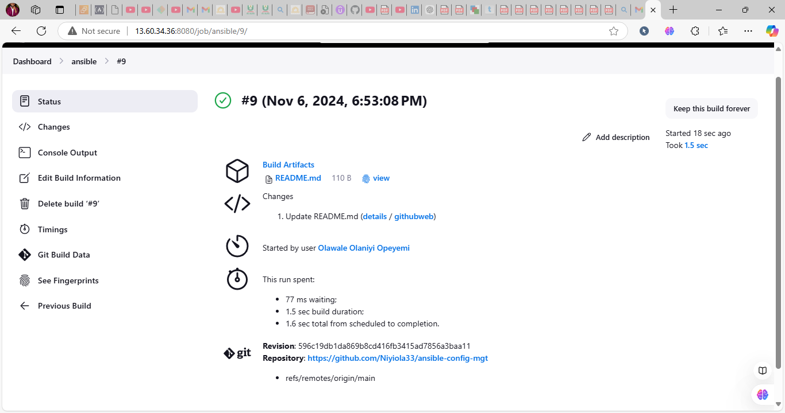
#### 3. Run the Playbook

After confirming that Jenkins has updated your Ansible configuration, SSH into your Jenkins-Ansible server using `ssh-agent` to manage your key.

Navigate to the project directory and run the playbook against the `uat` inventory:

```bash
cd /home/ubuntu/ansible-config-mgt
ansible-playbook -i inventory/uat.yml playbooks/site.yml
```
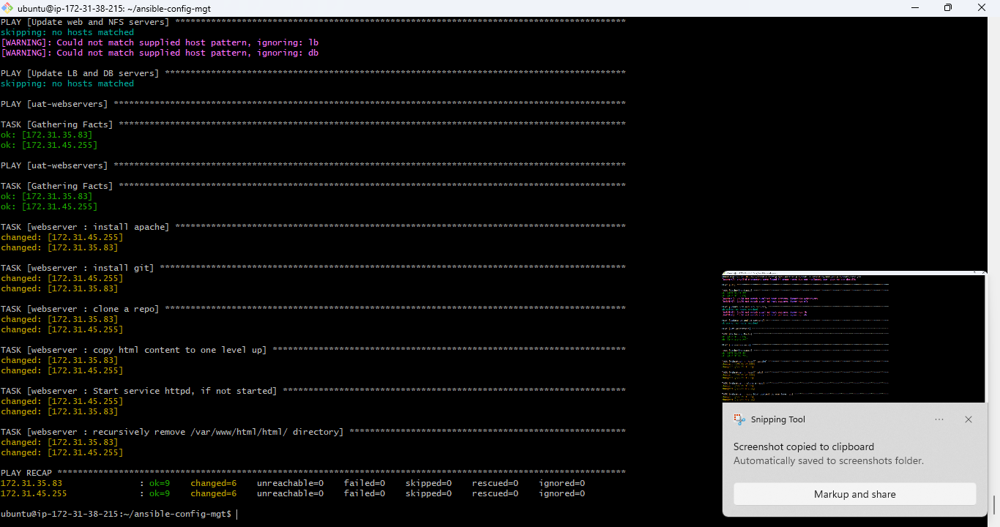
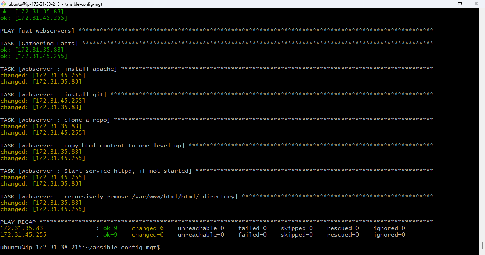
### Testing the UAT Web Servers

After running the playbook, you can test the configuration by accessing the UAT web servers in your browser:

- `http://<Web1-UAT-Server-Public-IP-or-Public-DNS-Name>/index.php`
- `http://<Web2-UAT-Server-Public-IP-or-Public-DNS-Name>/index.php`

### Summary

You have now successfully:
- Created and applied a dedicated `webserver` role to UAT web servers.
- Set up `uat-webservers.yml` to organize this configuration.
- Referenced the playbook in `site.yml` for seamless execution.
- Verified functionality through Jenkins automation and manual testing.


You now have a refactored Ansible setup with modular playbooks, improving code reusability and maintainability. This setup allows you to apply configurations across multiple servers with ease.

---