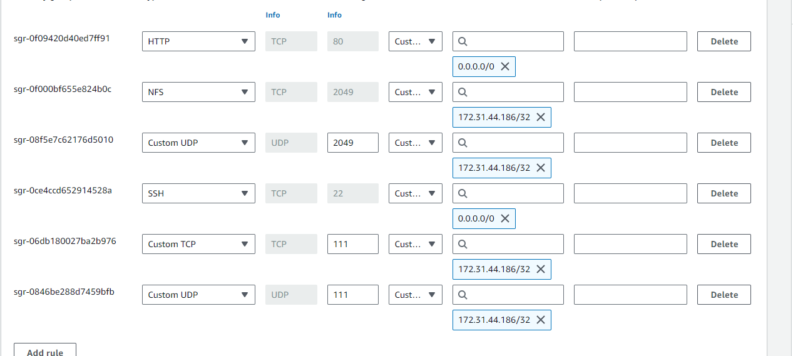
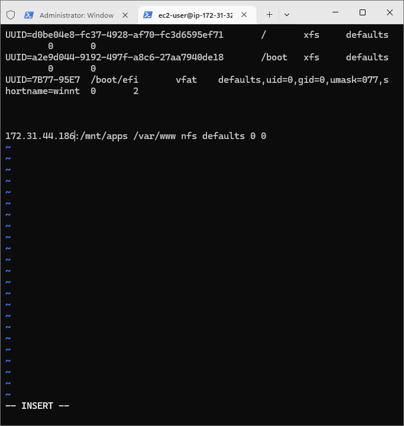

# DevOps Website Tooling
### Notes

In this project, you will implement a solution that consists of the following components:

1. Infrastructure: AWS
2. Webserver Linux: Red Hat Enterprise Linux 8
3. Database Server: Ubuntu 24.04 + MySQL
4. Storage Server: Red Hat Enterprise Linux 8 + NFS Server
5. Programming Language: PHP
6. Code Repository: GitHub

## Step 1 - Prepare NFS Server

### Launch an EC2 Instance

1. **Launch an EC2 Instance:**
   - Select RedHat as the AMI.
   - Choose an appropriate instance type (e.g., t2.micro).
   - Configure the instance with the required security group settings.

2. **Create and Attach EBS Volumes:**
   - Create 3 EBS volumes of 10 GiB each in the same Availability Zone as your EC2 instance.
   - Attach all three volumes to your EC2 instance.

   

### Configure the Server

1. **Connect to the EC2 Instance:**
   Open a terminal and connect via SSH:

   ```bash
   ssh ec2-user@<Public-IP>
   ```

2. **Inspect Block Devices:**
   Use the `lsblk` command to see attached block devices:

   ```bash
   lsblk
   ```

    

3. **Create Partitions:**
   Use the `gdisk` utility to create a single partition on each of the 3 disks:

   ```bash
   sudo gdisk /dev/nvme1n1
   # Follow the on-screen instructions to create a partition
   ```

   Repeat the partitioning steps for `/dev/nvme2n1` and `/dev/nvme3n1`.

   

4. **Install LVM2:**
   Install the LVM2 package:

   ```bash
   sudo yum install -y lvm2
   ```

5. **Create Physical Volumes:**
   Mark each of the 3 disks as physical volumes:

   ```bash
   sudo pvcreate /dev/nvme1n1p1
   sudo pvcreate /dev/nvme2n1p1
   sudo pvcreate /dev/nvme3n1p1
   ```
    
6. **Create a Volume Group:**
   Create a volume group named `webdata-vg`:

   ```bash
   sudo vgcreate webdata-vg /dev/xvdf1 /dev/xvdg1 /dev/xvdh1
   ```
    
   
7. **Create Logical Volumes:**
   Create three logical volumes: `lv-apps`, `lv-logs`, and `lv-opt`:

   ```bash
   sudo lvcreate -n lv-apps -L 5G webdata-vg
   sudo lvcreate -n lv-logs -L 5G webdata-vg
   sudo lvcreate -n lv-opt -L 2G webdata-vg
   ```

   

8. **Format Logical Volumes:**
   Format the logical volumes with the xfs filesystem:

   ```bash
   sudo mkfs -t xfs /dev/webdata-vg/lv-apps
   sudo mkfs -t xfs /dev/webdata-vg/lv-logs
   sudo mkfs -t xfs /dev/webdata-vg/lv-opt
   ```
    

9. **Create Directories:**
   Create directories for the website and logs:

   ```bash
   sudo mkdir -p /mnt/apps
   sudo mkdir -p /mnt/logs
   sudo mkdir -p /mnt/opt
   ```

10. **Mount Logical Volumes:**
    Mount the logical volumes to the created directories:

    ```bash
    sudo mount /dev/webdata-vg/lv-apps /mnt/apps
    sudo mount /dev/webdata-vg/lv-opt /mnt/opt
    sudo rsync -av /var/log/ /mnt/logs
    sudo mount /dev/webdata-vg/lv-logs /mnt/logs
    sudo rsync -av /home/recovery/logs/ /mnt/logs
    ```

    

    
    
    11. **Update /etc/fstab:**
    Update the `/etc/fstab` file to ensure the mount configuration persists after a reboot:

    ```bash
    sudo blkid
    sudo vi /etc/fstab
    ```

    Add the entries for the logical volumes using their UUIDs.

    
12. **Reload Daemon and Verify Setup:**
    Test the configuration and reload the daemon:

    ```bash
    sudo mount -a
    sudo systemctl daemon-reload
    ```

    Verify your setup:

    ```bash
    df -h
    ```

   

### NFS Server Setup and Configuration Guide
This guide provides step-by-step instructions for setting up an NFS server and configuring it for web server clients.

## Step 1: Update the System

Update the system packages to ensure you have the latest updates and security patches.

```sh
sudo yum -y update
```

## Step 2: Install NFS Utilities

Install the NFS utilities package.

```sh
sudo yum install nfs-utils -y
```

## Step 3: Start and Enable NFS Server

Start the NFS server and enable it to start at boot.

```sh
sudo systemctl start nfs-server.service
sudo systemctl enable nfs-server.service
sudo systemctl status nfs-server.service
```

## Step 4: Export the Mounts for Web Servers

Export the mounts for the web servers' subnet CIDR to connect as clients. Make sure all three web servers are inside the same subnet for simplicity. In production, you might want to separate each tier into its own subnet for higher security. To check your subnet CIDR, open your EC2 details in the AWS web console, locate the 'Networking' tab, and open a Subnet link.


## Step 5: Set Permissions

Set up permissions that allow web servers to read, write, and execute files on NFS.

```sh
sudo chown -R nobody: /mnt/apps
sudo chown -R nobody: /mnt/logs
sudo chown -R nobody: /mnt/opt

sudo chmod -R 777 /mnt/apps
sudo chmod -R 777 /mnt/logs
sudo chmod -R 777 /mnt/opt
```

## Step 6: Restart NFS Server

Restart the NFS server to apply the permission changes.

```sh
sudo systemctl restart nfs-server.service
```

## Step 7: Configure Access to NFS for Clients


Configure access to NFS for clients within the same subnet (replace `<Subnet-CIDR>` with your actual subnet CIDR, e.g., `172.31.32.0/20`).

```sh
sudo vi /etc/exports
```

Add the following lines:

```plaintext
/mnt/apps <Subnet-CIDR>(rw,sync,no_all_squash,no_root_squash)
/mnt/logs <Subnet-CIDR>(rw,sync,no_all_squash,no_root_squash)
/mnt/opt <Subnet-CIDR>(rw,sync,no_all_squash,no_root_squash)
```

Save and exit the editor (`Esc` + `:wq!`).


## Step 8: Export the NFS Shares

Export the NFS shares to make them available to clients.

```sh
sudo exportfs -arv
```

## Step 9: Check NFS Ports

Check which port is used by NFS and open it using Security Groups (add a new Inbound Rule).

```sh
rpcinfo -p | grep nfs
```

## Important Note

To ensure the NFS server is accessible from your client, you must also open the following ports:
- TCP 111
- UDP 111
- UDP 2049

These ports should be opened in your security group settings.


By following these steps, you will have a fully functional NFS server that your web server clients can connect to.

## Step 2 — Configure the Database Server

By now, you should know how to install and configure a MySQL DBMS to work with a remote Web Server.

### Install MySQL Server

1. Install MySQL server:
    ```sh
    sudo apt-get update
    sudo apt-get install mysql-server
    ```

2. Create a database and name it `tooling`:
    ```sh
    mysql -u root -p
    CREATE DATABASE tooling;
    ```

3. Create a database user and name it `webaccess`:
    ```sh
    CREATE USER 'webaccess'@'%' IDENTIFIED BY 'password';
    ```

4. Grant permission to the `webaccess` user on the `tooling` database to perform any action only from the web servers' subnet CIDR:
    ```sh
    GRANT ALL PRIVILEGES ON tooling.* TO 'webaccess'@'web-servers-subnet-cidr';
    FLUSH PRIVILEGES;
    ```

## Step 3 — Prepare the Web Servers

We need to make sure that our Web Servers can serve the same content from shared storage solutions, in our case - NFS Server and MySQL database. You already know that one DB can be accessed for reads and writes by multiple clients. For storing shared files that our Web Servers will use - we will utilize NFS and mount the previously created Logical Volume `lv-apps` to the folder where Apache stores files to be served to the users (`/var/www`).

This approach will make our Web Servers stateless, which means we will be able to add new ones or remove them whenever we need, and the integrity of the data (in the database and on NFS) will be preserved.

During the next steps we will do the following:

1. Configure NFS client (this step must be done on all three servers)
2. Deploy a Tooling application to our Web Servers into a shared NFS folder
3. Configure the Web Servers to work with a single MySQL database
4. Launch a new EC2 instance with RHEL 8 Operating System

### Install NFS Client

```sh
sudo yum install nfs-utils nfs4-acl-tools -y
```

### Mount `/var/www/` and Target the NFS Server's Export for Apps

1. Create the directory:
    ```sh
    sudo mkdir /var/www
    ```

2. Mount the directory:
    ```sh
    sudo mount -t nfs -o rw,nosuid <NFS-Server-Private-IP-Address>:/mnt/apps /var/www
    ```

3. Verify that NFS was mounted successfully by running `df -h`. Make sure that the changes will persist on the Web Server after reboot:
    ```sh
    sudo vi /etc/fstab
    ```

    Add the following line:
    ```plaintext
    <NFS-Server-Private-IP-Address>:/mnt/apps /var/www nfs defaults 0 0
    ```

### Install Remi's Repository, Apache, and PHP

```sh
sudo yum install httpd -y
sudo dnf install https://dl.fedoraproject.org/pub/epel/epel-release-latest-8.noarch.rpm
sudo dnf install dnf-utils http://rpms.remirepo.net/enterprise/remi-release-8.rpm
sudo dnf module reset php
sudo dnf module enable php:remi-7.4
sudo dnf install php php-opcache php-gd php-curl php-mysqlnd
sudo systemctl start php-fpm
sudo systemctl enable php-fpm
setsebool -P httpd_execmem 1
```

### Repeat Steps 1-5 for the Other 2 Web Servers

### Verify NFS Mounting

Verify that Apache files and directories are available on the Web Server in `/var/www` and also on the NFS server in `/mnt/apps`. If you see the same files, it means NFS is mounted correctly. You can try to create a new file using `touch test.txt` from one server and check if the same file is accessible from other Web Servers.

### Mount Apache Log Directory to NFS

Locate the log folder for Apache on the Web Server and mount it to NFS server's export for logs. Repeat the step to make sure the mount point will persist after reboot.

### Fork and Deploy Tooling Source Code

1. Fork the tooling source code from StegHub Github Account to your Github account.
 ```
    sudo git init
    git clone <your-fork-url>

```
2. Deploy the tooling website's code to the Webserver. Ensure that the `html` folder from the repository is deployed to `/var/www/html`.

**Note 1**: Do not forget to open TCP port 80 on the Web Server.

**Note 2**: If you encounter a 403 Error, check permissions to your `/var/www/html` folder and also disable SELinux:
```sh
sudo setenforce 0
```
To make this change permanent, open the following config file:
```sh
sudo vi /etc/sysconfig/selinux
```
Set `SELINUX=disabled`, then restart `httpd`.


### Update Website Configuration and Apply Database Script

1. Update the website's configuration to connect to the database in `/var/www/html/functions.php`.
2. Apply the `tooling-db.sql` script to your database using this command:
    ```sh
    mysql -h <database-private-ip> -u <db-username> -p <db-password> < tooling-db.sql
    ```

### Create a New Admin User in MySQL

Create a new admin user in MySQL with username: `myuser` and password: `password`:
```sql
INSERT INTO users (id, username, password, email, user_type, status) 
VALUES (1, 'myuser', '5f4dcc3b5aa765d61d8327deb882cf99', 'user@mail.com', 'admin', '1');
```

### Access the Website

Open the website in your browser:
```plaintext
http://<Web-Server-Public-IP-Address-or-Public-DNS-Name>/index.php
```

Make sure you can log in to the website with the `myuser` user.
 