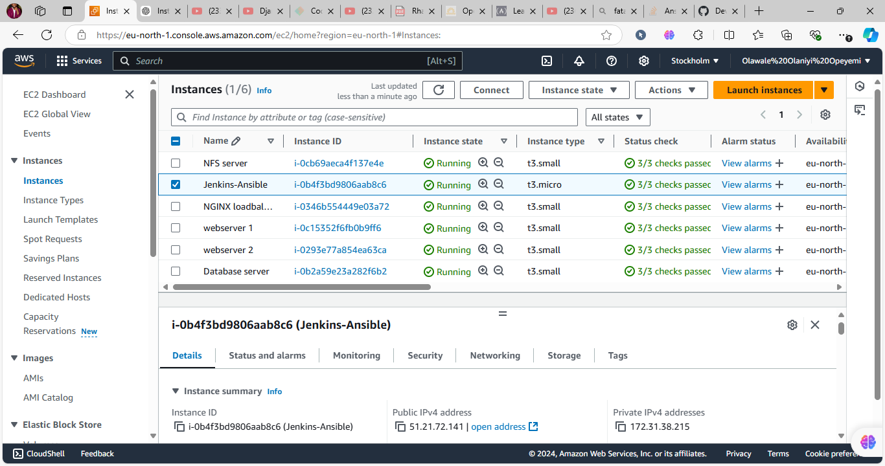
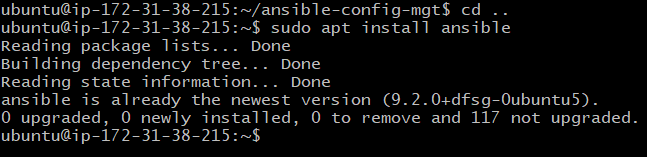
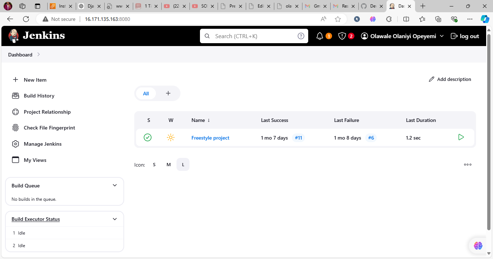
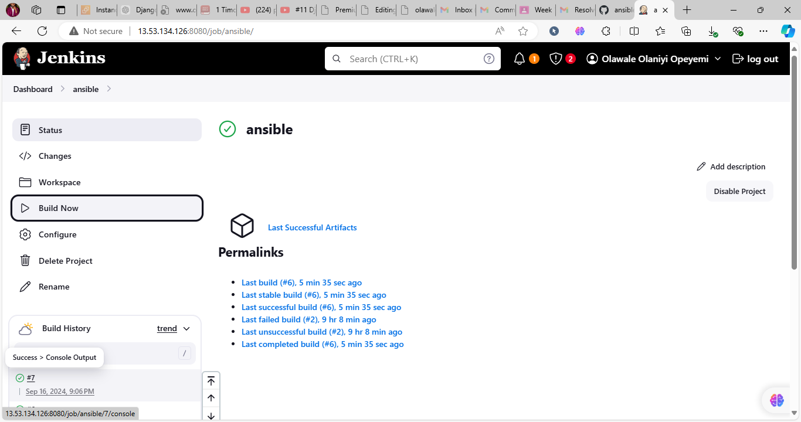
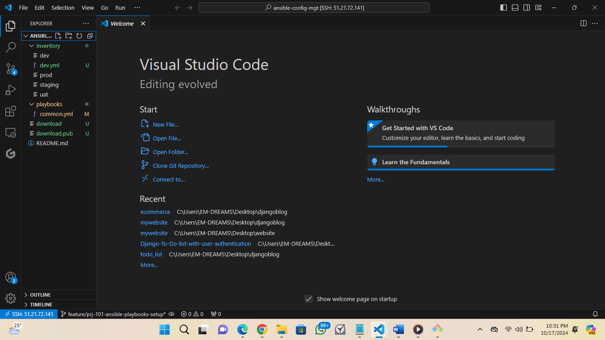
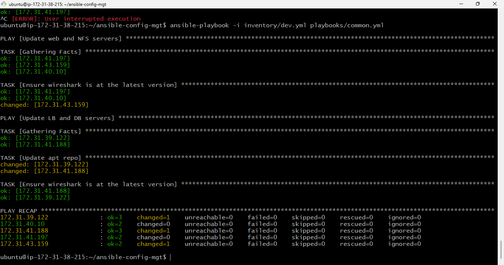
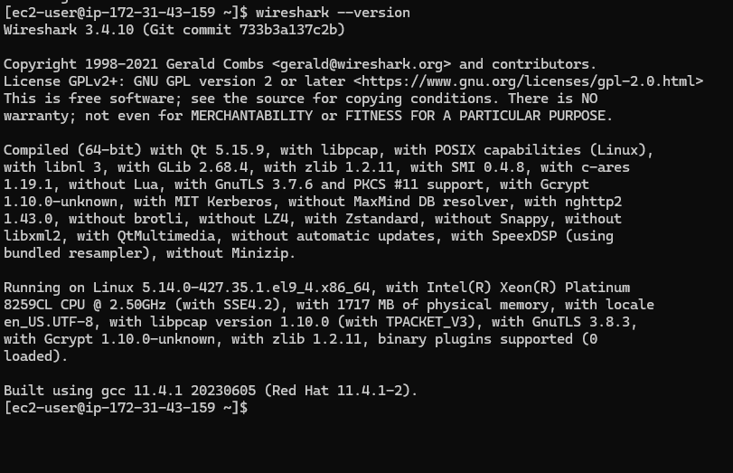

Ansible Configuration Management (Automate Project 7 to 10)

### Step 1 - Install and Configure Ansible on EC2 Instance

1. Update the Name tag on your Jenkins EC2 Instance to `Jenkins-Ansible`. This server will be used to run playbooks.

2. In your GitHub account, create a new repository and name it `ansible-config-mgt`.

3. Install Ansible using the following commands:
    ```bash
    sudo apt update
    sudo apt install ansible
    ```

4. Check your Ansible version:
    ```bash
    ansible --version
    ```

5. Configure a Jenkins build job to archive your repository content every time you change it.

6. Create a new Freestyle project `ansible` in Jenkins and point it to your `ansible-config-mgt` repository.

7. Configure a webhook in GitHub to trigger the `ansible` build.

8. Configure a post-build job to save all files (**), as done in Project 9.

9. Test the setup by making changes to the `README.md` file in the master branch, ensuring that the build starts automatically and Jenkins saves the files (build artifacts) in the following folder:
    ```bash
    ls /var/lib/jenkins/jobs/ansible/builds/<build_number>/archive/
    ```

10. **Tip:** Allocate an Elastic IP to your Jenkins-Ansible server to avoid reconfiguring the GitHub webhook every time the server is restarted.

---

### Step 2 - Prepare Your Development Environment Using Visual Studio Code

1. Install Visual Studio Code (VSC) from [here](https://code.visualstudio.com/).

2. Clone your `ansible-config-mgt` repo to your Jenkins-Ansible instance:
    ```bash
    git clone <ansible-config-mgt repo link>
    ```

---

### Step 3 - Begin Ansible Development

1. In your `ansible-config-mgt` GitHub repository, create a new branch for feature development. Use descriptive branch names (e.g., `feature/prj-145-lvm`).

2. Checkout the newly created feature branch and start building your code and directory structure.

3. Create the following directories:
    - `playbooks`: to store all playbook files.
    - `inventory`: to organize your hosts.

4. Within the `playbooks` folder, create your first playbook and name it `common.yml`.

5. Within the `inventory` folder, create inventory files for each environment: `dev`, `staging`, `uat`, and `prod`.

---

### Step 4 - Set Up an Ansible Inventory

An Ansible inventory file defines the hosts and groups of hosts upon which commands, modules, and tasks in a playbook operate.

1. Save the following inventory structure in the `inventory/dev.yml` file:
    ```ini
    [nfs]
    <NFS-Server-Private-IP-Address> ansible_ssh_user=ec2-user

    [webservers]
    <Web-Server1-Private-IP-Address> ansible_ssh_user=ec2-user
    <Web-Server2-Private-IP-Address> ansible_ssh_user=ec2-user

    [db]
    <Database-Private-IP-Address> ansible_ssh_user=ec2-user

    [lb]
    <Load-Balancer-Private-IP-Address> ansible_ssh_user=ubuntu
    ```

2. Use the `ssh-agent` to manage SSH keys for your servers:
    ```bash
    eval `ssh-agent -s`
    ssh-add <path-to-private-key>
    ssh-add -l
    ssh -A ubuntu@public-ip
    ```

---

### Step 5 - Create a Common Playbook

1. Update your `playbooks/common.yml` file with the following code:

    ```yaml
    ---
    - name: update web, nfs and db servers
      hosts: webservers, nfs, db
      become: yes
      tasks:
        - name: ensure wireshark is at the latest version
          yum:
            name: wireshark
            state: latest

    - name: update LB server
      hosts: lb
      become: yes
      tasks:
        - name: Update apt repo
          apt:
            update_cache: yes

        - name: ensure wireshark is at the latest version
          apt:
            name: wireshark
            state: latest
    ```

2. Update this playbook with additional tasks, such as:
    - Creating directories and files.
    - Changing time zones on all servers.
    - Running shell scripts.

---

### Step 6 - Update Git with the Latest Code

1. Commit your code into GitHub:
    ```bash
    git status
    git add <selected-files>
    git commit -m "commit message"
    ```

2. Create a Pull Request (PR) and get your branch peer-reviewed.

3. Once the review is complete, merge the code into the master branch.

4. Checkout the master branch locally and pull the latest changes:
    ```bash
    git checkout master
    git pull origin master
    ```

5. Jenkins will automatically save the files (build artifacts) in the following directory:
    ```bash
    /var/lib/jenkins/jobs/ansible/builds/<build_number>/archive/
    ```

---

### Step 7 - Run the First Ansible Test

1. Set up VSCode to connect to your instance.

2. Navigate to your `ansible-config-mgt` directory and run your playbook:
    ```bash
    cd ansible-config-mgt
    ansible-playbook -i inventory/dev.yml playbooks/common.yml
    ```

3. For detailed output (verbose mode):
    ```bash
    ansible-playbook -i inventory/dev.yml playbooks/common.yml -v
    ```



4. Confirm that Wireshark has been installed by running the following on each server:
    ```bash
    which wireshark
    wireshark --version
    ```

