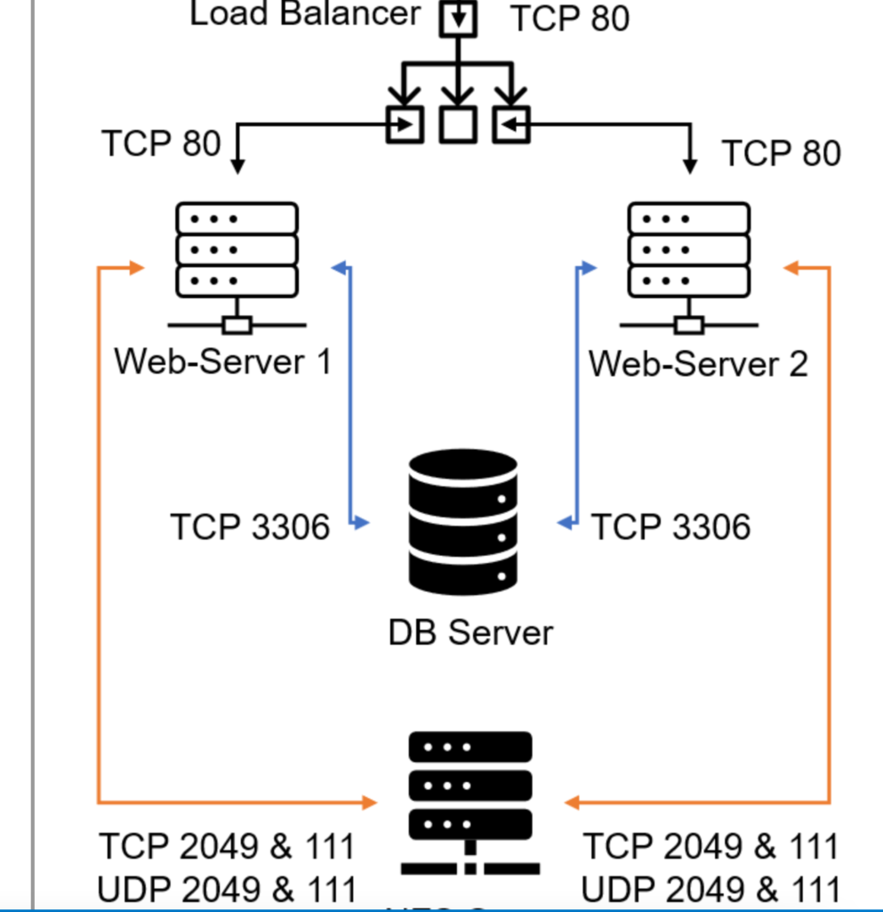

# Load Balancer Solution With Apache-102

## DevOps/Cloud Engineering: Load Balancer Solution With Apache-102

### COMPLETE

### Prerequisites

Make sure that you have the following servers installed and configured within the previous project(DevOps Tooling Website):
- Two RHEL8 Web Servers
- One MySQL DB Server (based on Ubuntu 20.04)
- One RHEL8 NFS server

### Configure Apache As A Load Balancer

1. **Create an Ubuntu Server 20.04 EC2 instance and name it `Project-8-apache-lb`**:
   - Your EC2 list will look like this:
   
2. **Open TCP port 80** on `Project-8-apache-lb` by creating an Inbound Rule in the Security Group.

3. **Install Apache Load Balancer on `Project-8-apache-lb` server and configure it to point traffic coming to LB to both Web Servers**:

   ```sh
   # Install apache2
   sudo apt update
   sudo apt install apache2 -y
   sudo apt-get install libxml2-dev
   
   # Enable following modules:
   sudo a2enmod rewrite
   sudo a2enmod proxy
   sudo a2enmod proxy_balancer
   sudo a2enmod proxy_http
   sudo a2enmod headers
   sudo a2enmod lbmethod_bytraffic
   
   # Restart apache2 service
   sudo systemctl restart apache2
   ```

4. **Make sure apache2 is up and running**:

   ```sh
   sudo systemctl status apache2
   ```
    
5. **Configure load balancing**:

   ```sh
   sudo vi /etc/apache2/sites-available/000-default.conf
   ```

   Add the following configuration within the `<VirtualHost *:80>` section:

   ```apache
   <Proxy "balancer://mycluster">
       BalancerMember http://<WebServer1-Private-IP-Address>:80 loadfactor=5 timeout=1
       BalancerMember http://<WebServer2-Private-IP-Address>:80 loadfactor=5 timeout=1
       ProxySet lbmethod=bytraffic
       # ProxySet lbmethod=byrequests
   </Proxy>

   ProxyPreserveHost On
   ProxyPass / balancer://mycluster/
   ProxyPassReverse / balancer://mycluster/
   ```

6. **Restart apache server**:

   ```sh
   sudo systemctl restart apache2
   ```
### Load Balancer Configuration

- The `bytraffic` balancing method will distribute incoming load between your Web Servers according to the current traffic load.
- Control the proportion of traffic distribution using the `loadfactor` parameter.
- You can also try other methods like: `bybusyness`, `byrequests`, `heartbeat`.

### Verification

1. **Verify that the configuration works**:
   - Access your LB's public IP address or Public DNS name from your browser:
     ```
     http://<Load-Balancer-Public-IP-Address-or-Public-DNS-Name>/index.php
     ```

2. **Note**: If in the previous project, you mounted `/var/log/httpd/` from your Web Servers to the NFS server - unmount them and make sure that each Web Server has its own log directory.

3. **Open two ssh/Putty consoles for both Web Servers and run the following command**:

   ```sh
   sudo tail -f /var/log/httpd/access_log
   ```

4. **Refresh your browser page**:

   ```
   http://<Load-Balancer-Public-IP-Address-or-Public-DNS-Name>/index.php
   ```

   - Ensure that both servers receive HTTP GET requests from your LB. New records must appear in each server's log file.
   - The number of requests to each server will be approximately the same since the `loadfactor` is set to the same value for both servers, meaning traffic will be distributed evenly.


### Conclusion

If you have configured everything correctly, your users will not even notice that their requests are served by more than one server.

# Load Balancer Solution With Apache-103

## DevOps/Cloud Engineering: Load Balancer Solution With Apache-103

### IN PROGRESS

### Optional Step - Configure Local DNS Names Resolution

Sometimes it is tedious to remember and switch between IP addresses, especially if you have a lot of servers under your management. What we can do is configure local domain name resolution. The easiest way is to use the `/etc/hosts` file. Although this approach is not very scalable, it is very easy to configure and demonstrates the concept well. So let us configure IP address to domain name mapping for our LB.

1. **Open this file on your LB server**:

   ```sh
   sudo vi /etc/hosts
   ```

2. **Add 2 records into this file with Local IP address and arbitrary name for both of your Web Servers**:

   ```
   <WebServer1-Private-IP-Address> Web1
   <WebServer2-Private-IP-Address> Web2
   ```

3. **Update your LB config file with those names instead of IP addresses**:

   ```apache
   BalancerMember http://Web1:80 loadfactor=5 timeout=1
   BalancerMember http://Web2:80 loadfactor=5 timeout=1
   ```

4. **You can try to curl your Web Servers from LB locally**:

   ```sh
   curl http://Web1
   curl http://Web2
   ```

  
   It should work.

### Note:

This is only an internal configuration and it is local to your LB server. These names will neither be 'resolvable' from other servers internally nor from the Internet.

### Target Architecture

Now your setup looks like this:



### Congratulations!