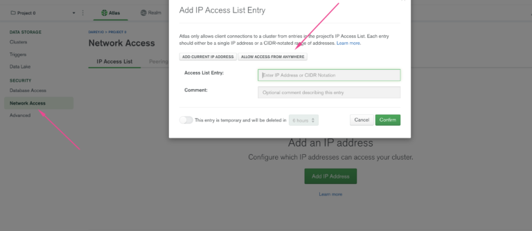
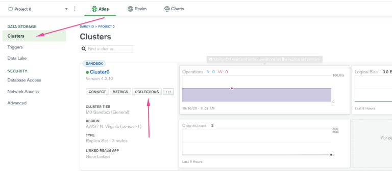
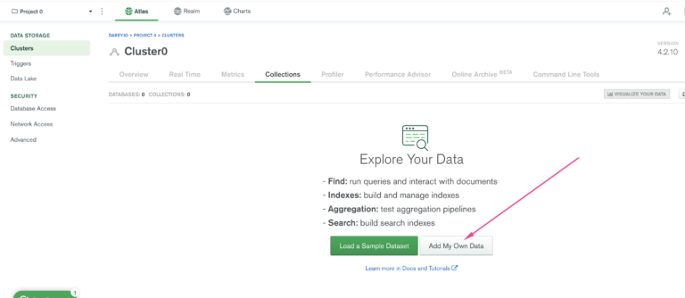
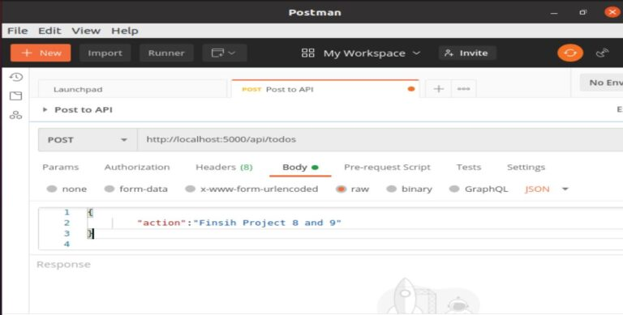
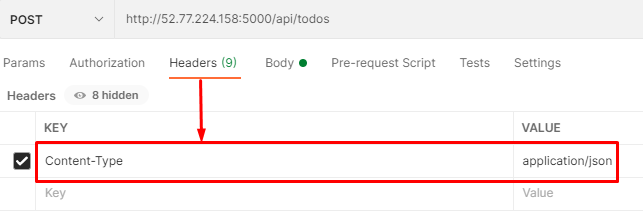

# MERN Web Stack-102

## Step 1 - Backend Configuration

### Update Ubuntu
Update Ubuntu with the following commands:
```bash
sudo apt update
sudo apt upgrade
```

### Install Node.js

Get the location of Node.js software from Ubuntu repositories:
~~~
curl -fsSL https://deb.nodesource.com/setup_18.x | sudo -E bash -
~~~

Install Node.js on the server:
~~~
sudo apt-get install -y nodejs
~~~

Note: The command above installs both Node.js and npm. NPM is a package manager for Node.js, similar to apt for Ubuntu, and it is used to install Node modules & packages and to manage dependency conflicts.

Verify the installation:
~~~
node -v
npm -v
~~~

Application Code Setup
Create a new directory for your To-Do project:

~~~
mkdir Todo
cd Todo
~~~
Initialize your project:

~~~
npm init
~~~
Follow the prompts to create a package.json file.
~~~
Install Express.js
Install Express.js 
~~~
using npm:
~~~
npm install express
~~~

Create a file index.js:

~~~
touch index.js
~~~
Install the dotenv module:
~~~
npm install dotenv
~~~

Open index.js and add the following code:

~~~
const express = require('express');
require('dotenv').config();

const app = express();
const port = process.env.PORT || 5000;

app.use((req, res, next) => {
  res.header("Access-Control-Allow-Origin", "*");
  res.header("Access-Control-Allow-Headers", "Origin, X-Requested-With, Content-Type, Accept");
  next();
});

app.use((req, res, next) => {
  res.send('Welcome to Express');
});

app.listen(port, () => {
  console.log(`Server running on port ${port}`)
});
~~~

Start your server:
~~~
node index.js
~~~

If everything is set up correctly, you should see Server running on port 5000 in your terminal.


Open Port 5000 in EC2 Security Groups
Refer to the setup in Project 1 Step 1 – Installing the Nginx Web Server. Create an inbound rule to open TCP port 5000.

Open your browser and access your server's Public IP or Public DNS name followed by port 5000:

http://<PublicIP-or-PublicDNS>:5000

Routes
> There are three actions that our To-Do application needs to handle:

> Create a new task
Display a list of all tasks
Delete a completed task
Each task will be associated with a specific endpoint and will use different standard HTTP request methods: POST, GET, DELETE.

Create a routes folder:

~~~
mkdir routes
cd routes
~~~

Create a file api.js:

~~~
touch api.js
vim api.js
~~~

Open api.js and add the following code:
~~~
const express = require('express');
const router = express.Router();

router.get('/todos', (req, res, next) => {});

router.post('/todos', (req, res, next) => {});

router.delete('/todos/:id', (req, res, next) => {});

module.exports = router;
~~~
#### Models
To create a schema and a model, install mongoose:

~~~
cd ..
npm install mongoose
mkdir models
cd models
touch todo.js
vim todo.js
~~~
Open todo.js and add the following code:

~~~
const mongoose = require('mongoose');
const Schema = mongoose.Schema;

// create schema for todo
const TodoSchema = new Schema({
  action: {
    type: String,
    required: [true, 'The todo text field is required']
  }
});

// create model for todo
const Todo = mongoose.model('todo', TodoSchema);

module.exports = Todo;
~~~
##### Update Routes
Update api.js to use the new model:
~~~
cd ../routes
vim api.js
~~~
Delete the existing content and add the following code:
~~~
:%d
~~~
~~~
const express = require('express');
const router = express.Router();
const Todo = require('../models/todo');

router.get('/todos', (req, res, next) => {
  Todo.find({}, 'action')
    .then(data => res.json(data))
    .catch(next);
});

router.post('/todos', (req, res, next) => {
  if (req.body.action) {
    Todo.create(req.body)
      .then(data => res.json(data))
      .catch(next);
  } else {
    res.json({
      error: "The input field is empty"
    });
  }
});

router.delete('/todos/:id', (req, res, next) => {
  Todo.findOneAndDelete({ "_id": req.params.id })
    .then(data => res.json(data))
    .catch(next);
});
module.exports = router;
~~~

##### MongoDB Database
1. Sign up at MongoDB Atlas

2. Select AWS as the cloud provider, 
3. create a MongoDB database and collection.

Create a file .env in your Todo directory:
~~~
touch .env
vim .env
~~~
Add the connection string to access the database:

~~~
DB='mongodb+srv://<username>:<password>@<network-address>/<dbname>?retryWrites=true&w=majority'
~~~
4. Ensure to update <username>, <password>, <network-address>, and <dbname> according to your setup.
.png>)
##### Update index.js
Update index.js to use .env for the database connection:



~~~
vim index.js
~~~
Delete the existing content and add the following code:
~~~
:%d
~~~
~~~
const express = require('express');
const bodyParser = require('body-parser');
const mongoose = require('mongoose');
const routes = require('./routes/api');
const path = require('path');
require('dotenv').config();

const app = express();
const port = process.env.PORT || 5000;

// connect to the database
mongoose.connect(process.env.DB, { useNewUrlParser: true, useUnifiedTopology: true })
  .then(() => console.log('Database connected successfully'))
  .catch(err => console.log(err));

// since mongoose promise is deprecated, we override it with Node's promise
mongoose.Promise = global.Promise;

app.use((req, res, next) => {
  res.header("Access-Control-Allow-Origin", "*");
  res.header("Access-Control-Allow-Headers", "Origin, X-Requested-With, Content-Type, Accept");
  next();
});

app.use(bodyParser.json());
app.use('/api', routes);

app.use((err, req, res, next) => {
  console.log(err);
  next();
});

app.listen(port, () => {
  console.log(`Server running on port ${port}`);
});
~~~
5. Start your server:

~~~
node index.js
~~~

##### Testing Backend Code without Frontend using RESTful API
1. Use Postman to test your API.

2. Create a POST request to the API:


3. Copy code http://<PublicIP-or-PublicDNS>:5000/api/todos
4. Ensure the header key Content-Type is set to application/json.

5. Create a GET request to your API:
6. Copy code
http://<PublicIP-or-PublicDNS>:5000/api/todos

## Step 2 - Frontend Creation
##### Scaffold Your App
In the same root directory as your backend code 
~~~
 cd Todo
npx create-react-app client
~~~

Install Dependencies
Install concurrently and nodemon:

~~~
npm install concurrently --save-dev
npm install nodemon --save-dev
~~~

##### Update package.json
1. In the Todo directory, update package.json:
~~~
vim package.json
~~~
~~~
"scripts": {
  "start": "node index.js",
  "start-watch": "nodemon index.js",
  "dev": "concurrently \"npm run start-watch\" \"cd client && npm start\""
}
~~~
3. Configure Proxy
Change directory to client:

~~~
cd client
~~~

4. Update package.json to include the proxy configuration:

>"proxy": "http://localhost:5000"

5. Start the Application
Ensure you are inside the Todo directory, and run:
~~~
npm run dev
~~~
Your app should open and start running on localhost:3000.

##### Creating React Components
Navigate to the client directory:
~~~
cd client/src
~~~

5. Create a components folder:
~~~
mkdir components
cd components
~~~
6. Create Input.js, ListTodo.js, and Todo.js:

~~~
touch Input.js ListTodo.js Todo.js
~~~
7. Input Component
Open Input.js and add the following code:
~~~
import React, { Component } from 'react';
import axios from 'axios';

class Input extends Component {
  state = {
    action: ""
  }

  addTodo = () => {
    const task = { action: this.state.action }
    if (task.action && task.action.length > 0) {
      axios.post('/api/todos', task)
        .then(res => {
          if (res.data) {
            this.props.getTodos();
            this.setState({ action: "" });
          }
        })
        .catch(err => console.log(err));
    } else {
      console.log('input field required');
    }
  }

  handleChange = (e) => {
    this.setState({ action: e.target.value });
  }
~~~

8. Go to the Todo directory
~~~
cd ../..
~~~
When you are in the Todo directory run:
~~~
npm run dev
~~~


open "http://localhost:3000" in the browser
Assuming no errors when saving all these files, our To-Do app should be ready and fully functional with the functionality.


